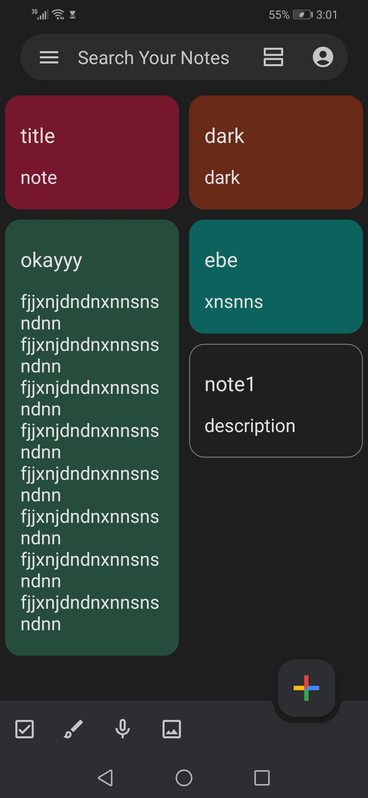
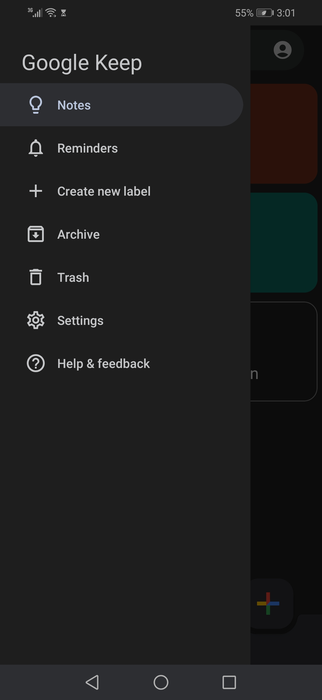
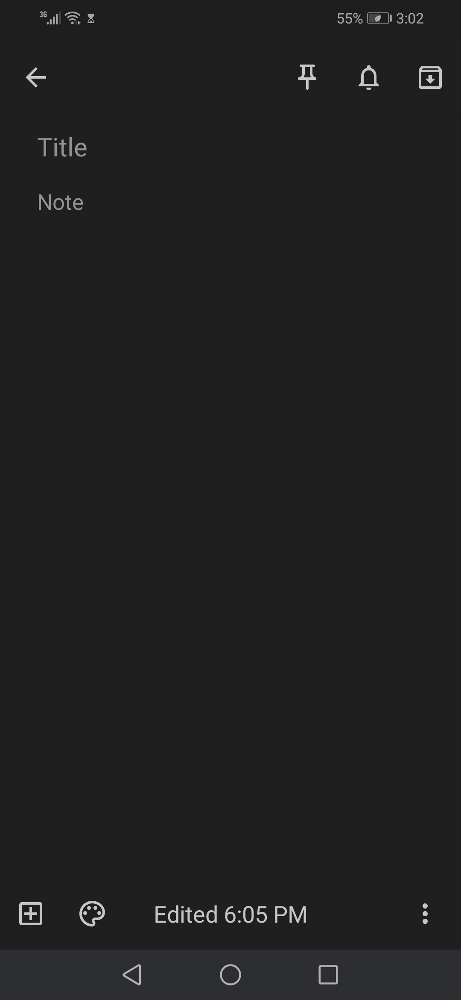
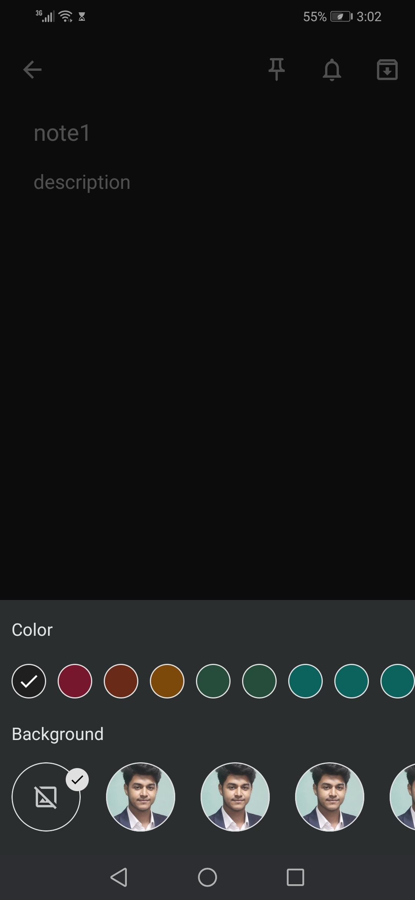
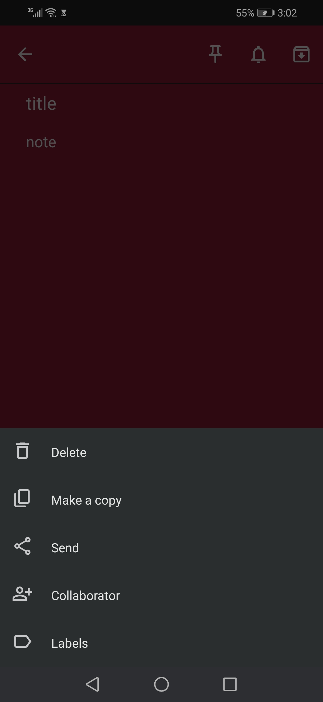

# Google-Keep-Clone

<table style="width:100%">
  <tr>
    <td>

## Google Keep Clone

 A clone of Android Google Keep app in Android built using Kotlin. Feautre containts creating notes,updating, customization, adding media files to notes and may more.

    
    
    
    
    
    

### The purpose of this repository

- Build a fully functional Android app built entirely with Kotlin and Material Design 2.
- Follows Android design and development best practices.
- Explore the possibilities of creating complex ui and ux of a popular apps made by Google.

### Status: 👨‍💻 In progress

Google Keep Clone is under active development.

</td> 
<td>
  
</td>
</tr>
</table>

### Stack

| Tools | Link |
|     :---      |          :---: |
| 🤖 Kotlin | [Kotlin](https://kotlinlang.org) |](https://developer.android.com/jetpack/compose) |
| 🏛 Architecture Components | [Android Architecture Components](https://developer.android.com/topic/libraries/architecture) |
| 🌐 Material Design | [Material Design](https://developer.android.com/jetpack/androidx/releases/compose-material) |
| 🌊 SQLite | [SQLite for Android](https://developer.android.com/jetpack/androidx/releases/sqlite?gclid=CjwKCAiAjs2bBhACEiwALTBWZXFwJylUA_K3H-yfDoYZAxhvWJy6ohbzoW_tHxeKdVnsBYURQInhQxoCRqIQAvD_BwE&gclsrc=aw.ds) |

## 📷 Screenshots

<table style="width:100%">
  <tr>
    <th>Welcome</th>
    <th>Menu</th> 
    <th>New Note</th>
    <th>Customizations</th>
  </tr>
  <tr>
    <td></td> 
    <td></td>
    <td></td> 
    <td></td>
  </tr>
  <tr>
    <th>Note Menu</th>
    <th>Upcoming</th>
    <th>Upcoming</th>
    <th>Upcoming</th>
  </tr>
  <tr>
    <td></td>
    <td></td>
    <td></td>
    <td></td>
  </tr>
</table>

[<a href="#top">Back to top</a>]

